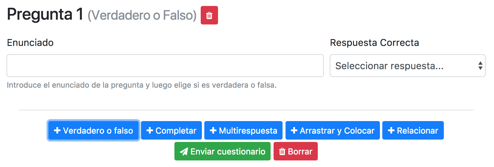

# jQuery

**jQuery** es una biblioteca multiplataforma de JavaScript, creada inicialmente por *John Resig*, que permite simplificar la manera de interactuar con los documentos HTML, manipular el árbol DOM, manejar eventos, desarrollar animaciones y agregar interacción con la técnica AJAX a páginas web. Fue presentada el 14 de enero de 2006 en el BarCamp NYC.

**jQuery** es la biblioteca de JavaScript más utilizady. Esta biblioteca es software libre y de código abierto, posee un doble licenciamiento bajo la Licencia MIT y la Licencia Pública General de GNU v2, permitiendo su uso en proyectos libres y privados.

* [Página oficial de jQuery](https://jquery.com/)

## Utilizando jQuery en RuQuiz

Una de las principales ventajas de **RuQuiz** es la facildad para crear nuevos cuestionarios. Toda la interfaz relacionada con la sección de crear cuestionarios está desarrollada gracias a **jQuery**. 

La idea básica era permitir a los profesores añadir el tipo de pregunta y número de preguntas que ellos quisieran, de manera sencilla e intuitiva. Para ello creamos los diferentes botones para cada tipo de pregunta y al hacer click en ellos es cuando interviene **jQuery**. 

En nuestra vista `app/views/newcuestionario.erb` podemos ver la siguiente línea: 

```html
<div id="questionsContainer" class="questions"></div>
```
Esta línea nos permite crear un contenedor vacío donde ir añadiendo las preguntas al hacer click en los botones correspondientes.


Si miramos el código de los botones en el fichero `app/views/newcuestionario.erb`, cada uno tiene un `id` asociado (`id="add1"`,`id="add2"`,`id="add3"`,...):

```html
<button type="button" class="btn btn-primary btn-sm" id="add1">Verdadero o falso</button>
<button type="button" class="btn btn-primary btn-sm" id="add2">Completar</button>
<button type="button" class="btn btn-primary btn-sm" id="add3">Multirespuesta</button>
<button type="button" class="btn btn-primary btn-sm" id="add4">Arrastrar y Colocar</button>
<button type="button" class="btn btn-primary btn-sm" id="add5">Relacionar</button>
```
En este momento es cuando entra en acción jQuery:

```js
$(document).ready(function() {
    var pregunta = 1;

    /* Añadir pregunta de tipo: Verdadero o Falso */
    $("#add1").click(function() {        

    });

    /* Añadir pregunta de tipo: Completar */
    $("#add2").click(function() {

    });

    /* Añadir pregunta de tipo: Multirespuesta */
    $("#add3").click(function() {

    });

    /* Añadir pregunta de tipo: Drag and Drop */
    $("#add4").click(function() {

    });

    /* Añadir pregunta de tipo: Relacionar */
    $("#add5").click(function() {

    });
});
```

Vemos como en el fichero `public/js/addQuestion.js` existe una función para cada identificador de pregunta, lo que nos permite añadir ejectuar diferentes acciones dependiendo del botón que seleccione el usuario.

En el interior de cada función escribimos el código `HTML` necesario para crear las preguntas con el formato deseado:



Una vez tenemos el código `HTML` utilizamos la función jQuery `.append()` que nos permite insertar código `HTML`.

